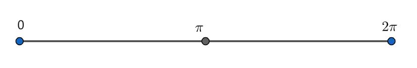
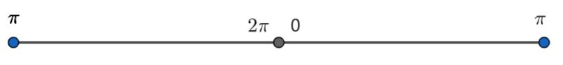

# Report

## Introduction

The MS(Mean Shift) algorithm is a kind of clustering algorithm based on the density estimation. Given discrete sampled data., the MS algorithm aims to locate the maxima of the density function. To estimate the density function, one simple approach is to smooth the data,  for example:
$$
f(x) = \sum_{i=1}^{N}K(\frac{x-x_i}{h})
$$
​	——The function K(x) is called the *kernel function* if there exists a profile such that:
$$
K(x) = k(||x||^2)
$$
​	the $k(x)$ should have the property:

​	1) $k$ in non-negative.

​	2) $k$ is non-increasing: $k(a) \geq k(b)$ if $a < b$

​	3) $k$ is piecewise continuous and $\int_{0}^{\infty}k(r)d(r) < \infty $

​	The sample mean with kernel K at $x \in X$ can be written as :
$$
m(x) = \frac{\sum_{s\in S'}K(s-x)w(s)s}{\sum_{s \in S'}K(s-x)w(s)}
$$
​	——where $S'$ is the a finite set(sample); $w(s)$ is the weight function.

​	Let $T \sub X$ is a finite set, and we use the MS algorithm iteratively  $T <- m(T)$ until converging.  If the set $T = S$, we call it a blurring process.

​	Based on the above information, we can simply summarise the process of the Mean Shift algorithm:

---

Given the sample set S' and the set T.

Initialise the parameters threshold $\epsilon$ , bandwidth $h$ :

For $p_i$ in T:
	Let $shifting\_p = p_i$
	Loop :
		Let $p_{old} = shifting\_p$
		$p_{new} = MS(p_{old})$
		Let $d = d(p_{old}, p_{new})$
		$shifting\_p = p_{new}$
		If $d < \epsilon$ :
			Exit loop
		Else :
			Continue

---

In this task, I give two different ways for mean shifting algorithm. The main difference of the two ways is how to compute the distance between the point in the set. The first one( **Alog1**) converts the point in the polar coordinate to Cartesian coordinate. The second one (**Algo2**) directly compute the distance between points with the raw format.

## Methods

### Distance between points

When we use the kernel function to estimate the density around the point x :
$$
f(x) = \sum_{i=1}^{N}K(\frac{x-x_i}{h})
$$
The difference with the format $x - x_{i}$ represents the **distance** between the two point.

#### Alog1

Since the given data is a kind of directional data, it has the format of $(\theta, r)$, where $\theta$ represents the angle, and $r$ represents the radius. We all know that the polar coordinate can be converted to Cartesian coordinate:
$$
x = r \cos{\theta}\\
y = r \sin {\theta}
$$
So, we can compute the distance between two points in Euclidean space:
$$
d(p_{1}, p_{2}) = \sqrt{(x_{1} - x_{2})^2 + ({y_1 - y_2})^2}
$$
After getting the data with the format of $(\theta,r)$, I first process the data, and convert it to Cartesian coordinate. The set after processing is called $S_p$. In the successive steps, I will use the MS algorithm on the processed data $S_p$.

#### Alog2

What we want to do is seek the mode of the sampled points. We can just compute the distance with the raw data similar to  Cartesian space:
$$
d(p_1, p_2) = \sqrt{({\theta_1 - \theta_2})^2 + ({r_1 - r_2})^2}
$$
However, the variable $\theta$ is angle in $[0, 2 \pi]$, the angle is a kind of periodic variable. That means the real distance between $0$ and $2\pi$ is $0$ , not $2\pi$. Similarly, the distance between $0$ and $\frac{3}{2} \pi$ is $\frac{1}{2} \pi$. As shown below:

So, to evaluate the distance between two angle should be :
$$
d(\theta_1, \theta_2) =
\begin{cases}
2\pi - |\theta_1 - \theta_2| &|\theta_1 - \theta_2|>\pi\\
|\theta_1 - \theta_2|  &else
\end{cases}
$$
The distance function can be written as :
$$
d(v_1,v_2) = \sqrt{d^2(\theta_1 - \theta_2) + (r_1 - r_2)^2}
$$

### Parameters choosing

#### Bandwidth

The main parameter of the algorithm MS is the *bandwidth* of the kernel function. If the *bandwidth* is too small, there may be a question that the points included are not enough. This may result int too many clusters .But if the *bandwidth* is too large, this can result in only one cluster in the end.

So, there is a trade-off when choosing the parameter. The probability density function $f(x)$ has two parameters : $N$ and $h$. If the size of the sample( $N$ )  is infinity ( $N -> \infin$), h should approaches zero ($h -> 0$). By this, we can get the relationship between $N$ and $h$ :
$$
h = cN^{-1/5}
$$
​	——where $c$ is a constant

​	For the Gaussian distribution, $h$ is :
$$
\begin{align}
h &= (\frac{4\sigma^5}{3N})^{1/5}
=\frac{1.05 * \sigma}{N^5}
\end{align}
$$
​	——where $\sigma$ is the standard deviation for  the sample.

In this task, we have two dimensional variables, we can choose to compute separately or we can use the distance function to convert the two dimensional space to one dimensional space.

#### Kernel function

The common kernel function used is *flat kernel* :
$$
F(x) =
\begin{cases}
1 &if ||x|| \le h\\
0 &if ||x|| > h
\end{cases}
$$
and *Gaussian kernel*:
$$
G(x) = \frac{1}{h\sqrt{2\pi}} e^{-\frac{||x||^2}{2h^2}}
$$
The kernel function can be seen as the weight to estimate the point around the point $x$, the *flat kernel* is a kind of d-dimensional sphere. Only the point in the d-dimensional sphere will be considered. The *Gaussian kernel* consider all the points in the set, but the closer the points is, the larger weight is set.

In this task, we use the *Gaussian kernel* as the kernel function.

#### Weight function

Weight function *w(s)* can be fixed or re-evaluated after each iteration. In this task, the Gaussian kernel has set the weight for each point. So I just set $w(s) = 1$ .

#### ~~Threshold~~

~~The parameter threshold is used to decide when to stop the iteration. If the threshold is too large, the ultimate number of cluster may be large. If the threshold is small, it will consume more time to converge.~~

### Data Analysis

#### Computing Means

After MS algorithm, we will get the different "modes". If we want to estimate the basic parameters of each cluster (mainly the mean and the variance). First we need to find the centre of each cluster by computing the means of each cluster. So, how to compute the mean of the data?

The simplest idea is $\bar{x} = \frac{1}{N} \sum_{i}^N{x_i}$. For the $\theta$, it can be seen as a point on a unit circle. We can cut the circle and make it a line:

By choosing the point where to cut, we can also get the line as below:

So, the cutting point may have effect on the out result.

Based on the **Algo1**, we can also convert the point to Cartesian coordinate $[x,y]^T = [\cos(\theta), \sin(\theta)]^T$. So we can compute the mean value of each axis separately by :
$$
\bar{c} = \frac{1}{N} \sum_{i}^{N}\cos{\theta_{i}} \\
\bar{s} = \frac{1}{N} \sum_{i}^{N}\sin{\theta_{i}}
$$
So, we can get centre of the cluster, for its $\theta_c$ variable, it has the format:
$$
\cos(\theta_c) = \bar{c} = \frac{1}{N} \sum_{i}^{N}\cos{\theta_{i}} \\
\sin(\theta_c) = \bar{s} = \frac{1}{N} \sum_{i}^{N}\sin{\theta_{i}}
$$
Back to the $\theta$:

$$
\theta_c = 
\begin{cases}
\arctan{(\frac{\sin{\theta_c}}{\cos{\theta_c}})} &if \cos{\theta_c} >0\\
arctan{(\frac{\sin{\theta_c}}{\cos{\theta_c}})}+\pi &if \cos{\theta_c} <0
\end{cases}
$$

For the radius $r$, we can just compute it by :
$$
\bar{r} = \sum_{i}^{N}r_i
$$

#### Computing Variance

Variance is a measure of dispersion, based on the the meaning of distance of two circular-linear point, we compute the variance in the distance space:
$$
\begin{align}
\sigma^2 &= \frac{1}{N-1}\sum_{i=1}^{N}(p_i - p_c)^2\\
&=\frac{1}{N-1}\sum_{i=1}^{N}d(p_i, p_c)^2
\end{align}
$$

## Conclusion